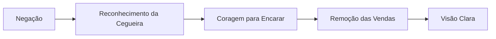

# 🎭 Satariel - A Ocultação de Deus

## 📋 Informações Básicas
| Aspecto | Detalhe |
|---------|---------|
| **🌍 Nome Completo** | Satariel (סטאריאל) |
| **📏 Posição** | Terceiro Túnel - Entendimento Invertido |
| **⚖️ Correspondência** | Binah (Entendimento) na Árvore da Vida |
| **🎯 Significado** | "A Ocultação de Deus" ou "Os que Escondem" |
| **🔥 Demônio Regente** | Lucifuge |

## 🎭 Natureza e Características

### 🌪️ **Essência do Túnel**
Satariel representa a **corrupção do entendimento divino** em negação e ocultação da verdade. Enquanto Binah é compreensão profunda e percepção clara, Satariel manifesta a **cegueira espiritual** e a recusa em ver o que é evidente.

### 💫 **Atributos Principais**
- **Negação** da realidade espiritual
- **Cegueira** voluntária
- **Ocultação** da verdade
- **Fuga** da responsabilidade

---

## 👁️ Simbologia e Correspondências

### 🔮 **Símbolos Associados**
- **Venda** nos olhos
- **Porta trancada**
- **Névoa** espessa
- **Máscara** de ignorância

### 🎨 **Cores e Elementos**
| Elemento | Cor | Significado |
|----------|-----|-------------|
| **Terra Pesada** | 🟫 Marrom escuro | Estagnação espiritual |
| **Ar Densificado** | ⚫ Cinza chumbo | Recusa do insight |

### 🔢 **Numerologia**
- **Número**: 33 (3+3=6, mas em desequilíbrio)
- **Significado**: Compreensão distorcida

---

## 🧠 Aspectos Psicológicos

### 🎪 **Manifestações na Psique**
- **Negação** de verdades dolorosas
- **Autoengano** sistemático
- **Recusa** em amadurecer
- **Fuga** do autoconhecimento

### 💔 **Padrões Comportamentais**
- **"Se não vejo, não existe"**
- **Ignorância deliberada**
- **Responsabilidade terceirizada**
- **Maturidade evitada**
- **Verdades suprimidas**

---

## 🛡️ Trabalho Espiritual

### 🎯 **Desafios Principais**
1. **Remover** as vendas autoimpostas
2. **Encarar** verdades desconfortáveis
3. **Aceitar** responsabilidade pessoal
4. **Amadurecer** através da verdade

### 🧘 **Práticas Recomendadas**

#### 📝 **Meditação Guiada**
1. Visualize-se com vendas nos olhos
2. Sinta a coragem para removê-las
3. Encare gradualmente a luz da verdade
4. Aceite o que foi revelado com compaixão

#### ✍️ **Exercício de Reflexão (Perguntas para explorar)**
- Quais verdades estou evitando?
- Onde coloco vendas sobre meus olhos?
- Que responsabilidades estou terceirizando?
- Como a negação me serve?

---

## ⚠️ Perigos e Advertências

### 🚨 **Riscos Espirituais**
- **Estagnação** no desenvolvimento
- **Alienação** da própria verdade
- **Vitimização** crônica
- **Perda** de autenticidade

### 🛡️ **Proteções Recomendadas**
- **Praticar** honestidade radical consigo mesmo
- **Buscar** feedback verdadeiro
- **Aceitar** desconforto do crescimento
- **Desenvolver** coragem emocional

---

## 📚 Correspondências Detalhadas

### 🌌 **Associações Mágicas**
| Elemento | Detalhe |
|----------|---------|
| **Planeta** | Saturno (em aspecto negativo) |
| **Direção** | Norte (direção do ocultamento) |
| **Tempo** | Períodos de negação necessária |

### 📖 **Invocações e Evocações**
> **Nota**: Apenas para praticantes avançados
> - **Chave**: Vontade de ver a verdade
> - **Oferecimento**: Entrega das ilusões
> - **Resultado**: Visão clara da realidade

---

## 💡 Aprendizados

### 🌟 **Lições de Satariel**
- **A verdade** liberta, mesmo quando dói
- **A maturidade** exige coragem de ver
- **A negação** é prisão voluntária
- **O autoconhecimento** é o antídoto

### 📈 **Evolução Espiritual**

## 🔄 Conexões com Outros Túneis

### ⬅️ **Influência de Ghagiel**
A confusão mental precede a negação espiritual

### ➡️ **Preparação para Gamchicoth**
A negação espiritual leva ao materialismo excessivo

---

> **⚠️ Conclusão**: Satariel nos ensina que a verdade, por mais dolorosa que seja, é sempre preferível à ilusão confortável. Trabalhar com este túnel requer coragem para enfrentar nossas próprias negações e maturidade para aceitar a realidade como ela é.
