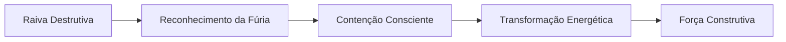

# 🔥 Golachab - Os Incendiários

## 📋 Informações Básicas
| Aspecto | Detalhe |
|---------|---------|
| **🌍 Nome Completo** | Golachab (גולכאב) |
| **📏 Posição** | Quinto Túnel - Julgamento Invertido |
| **⚖️ Correspondência** | Geburah (Julgamento) na Árvore da Vida |
| **🎯 Significado** | "Os Incendiários" ou "Os que Queimam" |
| **🔥 Demônio Regente** | Asmodeus |

## 🎭 Natureza e Características

### 🌪️ **Essência do Túnel**
Golachab representa a **corrupção do julgamento divino** em fúria destrutiva e crueldade. Enquanto Geburah é justiça equilibrada e disciplina necessária, Golachab manifesta a **violência descontrolada** que destrói sem propósito.

### 💫 **Atributos Principais**
- **Raiva** descontrolada
- **Destruição** sem propósito
- **Crueldade** e sadismo
- **Fanatismo** cego

---

## 👁️ Simbologia e Correspondências

### 🔮 **Símbolos Associados**
- **Chamas** consumidoras
- **Espada** ensanguentada
- **Punho** cerrado
- **Cicatrizes** de guerra

### 🎨 **Cores e Elementos**
| Elemento | Cor | Significado |
|----------|-----|-------------|
| **Fogo Devorador** | 🔴 Vermelho sangue | Raiva destrutiva |
| **Metal Cortante** | ⚫ Cinza aço | Rigidez cruel |

### 🔢 **Numerologia**
- **Número**: 55 (5+5=10, mas em desequilíbrio)
- **Significado**: Poder sem compaixão

---

## 🧠 Aspectos Psicológicos

### 🎪 **Manifestações na Psique**
- **Ressentimento** acumulado
- **Impulsos** violentos reprimidos
- **Justiça** própria exagerada
- **Intolerância** à frustração

### 💔 **Padrões Comportamentais**
- **"Tudo deve queimar"**
- **Explosões de raiva**
- **Críticas destrutivas**
- **Vingança como motivação**
- **Autossabotagem através da fúria**

---

## 🛡️ Trabalho Espiritual

### 🎯 **Desafios Principais**
1. **Reconhecer** a raiva sem agir
2. **Transformar** fúria em força construtiva
3. **Aceitar** a imperfeição do mundo
4. **Desenvolver** compaixão pelo caos

### 🧘 **Práticas Recomendadas**

#### 📝 **Meditação Guiada**
1. Visualize suas chamas internas de raiva
2. Respire e observe sem alimentar o fogo
3. Transforme o calor em energia vital
4. Direcione essa força para criação

#### ✍️ **Exercício de Reflexão (Perguntas para explorar)**
- O que realmente me enfurece?
- Como transformo raiva em ação positiva?
- Onde preciso estabelecer limites saudáveis?
- Como lido com minha própria agressividade?

---

## ⚠️ Perigos e Advertências

### 🚨 **Riscos Espirituais**
- **Auto-destruição** por raiva internalizada
- **Isolamento** por comportamento explosivo
- **Karma** negativo por ações cruéis
- **Perda** de conexão humana

### 🛡️ **Proteções Recomendadas**
- **Praticar** artes marciais ou exercício intenso
- **Desenvolver** pausas entre impulso e ação
- **Cultivar** compaixão por si e outros
- **Expressar** raiva de forma segura e consciente

---

## 📚 Correspondências Detalhadas

### 🌌 **Associações Mágicas**
| Elemento | Detalhe |
|----------|---------|
| **Planeta** | Marte (em aspecto negativo) |
| **Direção** | Sul (direção da paixão destrutiva) |
| **Tempo** | Momentos de grande frustração |

### 📖 **Invocações e Evocações**
> **Nota**: Apenas para praticantes avançados
> - **Chave**: Reconhecimento da força interior
> - **Oferecimento**: Transformação da raiva
> - **Resultado**: Poder disciplinado

---

## 💡 Aprendizados

### 🌟 **Lições de Golachab**
- **A raiva** é energia que pode ser transformada
- **Os limites** são necessários mas não precisam ser violentos
- **A destruição** pode abrir espaço para novo crescimento
- **A força** verdadeira inclui controle

### 📈 **Evolução Espiritual**

---

## 🔄 Conexões com Outros Túneis

### ⬅️ **Influência de Gamchicoth**
A ganância frustrada gera fúria quando ameaçada

### ➡️ **Preparação para Thagirion**
A raiva destrutiva leva ao sofrimento existencial

---

> **⚠️ Conclusão**: Golachab nos ensina que a verdadeira força não está na destruição, mas na capacidade de conter e transformar nossa energia mais intensa. A raiva, quando conscientizada, torna-se combustível para mudanças profundas.
