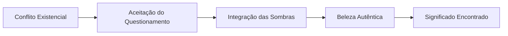

# ⚔️ Thagirion - Os Contempladores

## 📋 Informações Básicas
| Aspecto | Detalhe |
|---------|---------|
| **🌍 Nome Completo** | Thagirion (תגיריון) |
| **📏 Posição** | Sexto Túnel - Beleza Invertida |
| **⚖️ Correspondência** | Tiphereth (Beleza) na Árvore da Vida |
| **🎯 Significado** | "Os Contempladores" ou "Os que Questionam" |
| **🔥 Demônio Regente** | Belphegor |

## 🎭 Natureza e Características

### 🌪️ **Essência do Túnel**
Thagirion representa a **corrupção da beleza espiritual** em sofrimento existencial e conflito interno. Enquanto Tiphereth é harmonia e centro equilibrado, Thagirion manifesta o **questionamento doloroso** que paralisa e a beleza que se torna máscara.

### 💫 **Atributos Principais**
- **Conflito** existencial
- **Sofrimento** sem propósito
- **Questionamento** paralisante
- **Beleza** superficial e enganosa

---

## 👁️ Simbologia e Correspondências

### 🔮 **Símbolos Associados**
- **Máscara** sorridente com lágrimas
- **Espelho** quebrado
- **Labirinto** mental
- **Rosa** com espinhos venenosos

### 🎨 **Cores e Elementos**
| Elemento | Cor | Significado |
|----------|-----|-------------|
| **Ar Pesado** | 🌫️ Cinza azulado | Depressão existencial |
| **Fogo Congelado** | ❄️ Azul gélido | Paixão paralisada |

### 🔢 **Numerologia**
- **Número**: 66 (6+6=12 → 1+2=3, em desequilíbrio)
- **Significado**: Harmonia perdida

---

## 🧠 Aspectos Psicológicos

### 🎪 **Manifestações na Psique**
- **Crise** de significado
- **Autoquestionamento** excessivo
- **Depressão** existencial
- **Conflito** entre aparência e realidade

### 💔 **Padrões Comportamentais**
- **"Por que nada faz sentido?"**
- **Paralisia por análise**
- **Sofrimento como identidade**
- **Busca obsessiva por significado**
- **Beleza como fachada**

---

## 🛡️ Trabalho Espiritual

### 🎯 **Desafios Principais**
1. **Encontrar** significado no caos
2. **Integrar** sombra e luz
3. **Aceitar** a imperfeição da existência
4. **Transformar** sofrimento em sabedoria

### 🧘 **Práticas Recomendadas**

#### 📝 **Meditação Guiada**
1. Visualize-se diante de um espelho quebrado
2. Aceite cada fragmento como parte de você
3. Reconstrua a imagem com compaixão
4. Encontre beleza na imperfeição

#### ✍️ **Exercício de Reflexão (Perguntas para explorar)**
- Que máscaras uso para esconder meu sofrimento?
- Onde busco significado genuíno?
- Como posso integrar meus conflitos internos?
- O que o sofrimento me ensina?

---

## ⚠️ Perigos e Advertências

### 🚨 **Riscos Espirituais**
- **Estagnação** em crise existencial
- **Cínismo** e desespero
- **Perda** de conexão com a vida
- **Identificação** com o sofrimento

### 🛡️ **Proteções Recomendadas**
- **Praticar** gratidão pelas pequenas coisas
- **Buscar** serviço aos outros
- **Cultivar** conexões genuínas
- **Encontrar** beleza no ordinário

---

## 📚 Correspondências Detalhadas

### 🌌 **Associações Mágicas**
| Elemento | Detalhe |
|----------|---------|
| **Planeta** | Sol (em aspecto negativo) |
| **Direção** | Centro (núcleo do conflito) |
| **Tempo** | Crises de meia-idade espiritual |

### 📖 **Invocações e Evocações**
> **Nota**: Apenas para praticantes avançados
> - **Chave**: Aceitação do paradoxo
> - **Oferecimento**: Entrega do sofrimento
> - **Resultado**: Sabedoria através da dor

---

## 💡 Aprendizados

### 🌟 **Lições de Thagirion**
- **O significado** nasce do questionamento, não das respostas
- **A verdadeira beleza** inclui as sombras
- **O sofrimento** pode ser portal de transformação
- **Os conflitos** nos tornam inteiros

### 📈 **Evolução Espiritual**

---

## 🔄 Conexões com Outros Túneis

### ⬅️ **Influência de Golachab**
A raiva destrutiva internalizada gera sofrimento existencial

### ➡️ **Preparação para Gha'agsheblah**
O vazio existencial busca preenchimento através do desejo

---

> **⚠️ Conclusão**: Thagirion nos ensina que a verdadeira beleza espiritual não é ausência de conflito, mas a capacidade de abraçar nossos paradoxos internos. O sofrimento, quando conscientemente trabalhado, torna-se o crisol onde forjamos nosso significado mais profundo.
