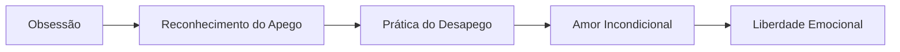

# 🌊 Gha'agsheblah - Os Fetichistas

## 📋 Informações Básicas
| Aspecto | Detalhe |
|---------|---------|
| **🌍 Nome Completo** | Gha'agsheblah (געגשבלה) |
| **📏 Posição** | Sétimo Túnel - Vitória Invertida |
| **⚖️ Correspondência** | Netzach (Vitória) na Árvore da Vida |
| **🎯 Significado** | "Os Fetichistas" ou "Os Obsessivos" |
| **🔥 Demônio Regente** | Baal |

## 🎭 Natureza e Características

### 🌪️ **Essência do Túnel**
Gha'agsheblah representa a **corrupção da vitória espiritual** em desejo obsessivo e apego emocional doentio. Enquanto Netzach é perseverança e emoções equilibradas, Gha'agsheblah manifesta a **fixação compulsiva** que escraviza através do desejo.

### 💫 **Atributos Principais**
- **Desejo** obsessivo
- **Fixação** compulsiva
- **Apego** emocional doentio
- **Vício** emocional e relacional

---

## 👁️ Simbologia e Correspondências

### 🔮 **Símbolos Associados**
- **Correntes** de seda
- **Círculo** vicioso
- **Espelho** de desejo
- **Labirinto** emocional

### 🎨 **Cores e Elementos**
| Elemento | Cor | Significado |
|----------|-----|-------------|
| **Água Estagnada** | 🌊 Verde escuro | Emoções obsessivas |
| **Fogo Lento** | 🔥 Laranja enferrujado | Desejo consumidor |

### 🔢 **Numerologia**
- **Número**: 77 (7+7=14 → 1+4=5, em desequilíbrio)
- **Significado**: Liberdade perdida no desejo

---

## 🧠 Aspectos Psicológicos

### 🎪 **Manifestações na Psique**
- **Obsessão** por pessoas ou ideias
- **Dependência** emocional
- **Necessidade** de controle relacional
- **Medo** de abandono e perda

### 💔 **Padrões Comportamentais**
- **"Não posso viver sem..."**
- **Ciúme doentio**
- **Controle em relacionamentos**
- **Idealização obsessiva**
- **Medo de solidão**

---

## 🛡️ Trabalho Espiritual

### 🎯 **Desafios Principais**
1. **Reconhecer** padrões obsessivos
2. **Libertar-se** de apegos doentios
3. **Cultivar** amor próprio
4. **Transformar** desejo em aspiração espiritual

### 🧘 **Práticas Recomendadas**

#### 📝 **Meditação Guiada**
1. Visualize as correntes do apego emocional
2. Identifique o que verdadeiramente busca
3. Libere a necessidade de posse
4. Transforme o desejo em amor incondicional

#### ✍️ **Exercício de Reflexão (Perguntas para explorar)**
- De quem ou do que sou dependente emocionalmente?
- O que temo perder?
- Como posso amar sem possuir?
- O que realmente busco através do desejo?

---

## ⚠️ Perigos e Advertências

### 🚨 **Riscos Espirituais**
- **Escravidão** emocional
- **Perda** de identidade própria
- **Relacionamentos** abusivos
- **Estagnação** no desenvolvimento

### 🛡️ **Proteções Recomendadas**
- **Estabelecer** limites saudáveis
- **Cultivar** autoamor
- **Praticar** desapego consciente
- **Desenvolver** independência emocional

---

## 📚 Correspondências Detalhadas

### 🌌 **Associações Mágicas**
| Elemento | Detalhe |
|----------|---------|
| **Planeta** | Vênus (em aspecto negativo) |
| **Direção** | Sudoeste (direção do apego) |
| **Tempo** | Períodos de carência emocional |

### 📖 **Invocações e Evocações**
> **Nota**: Apenas para praticantes avançados
> - **Chave**: Reconhecimento da liberdade interior
> - **Oferecimento**: Entrega dos apegos
> - **Resultado**: Amor verdadeiro sem posse

---

## 💡 Aprendizados

### 🌟 **Lições de Gha'agsheblah**
- **O verdadeiro amor** liberta, não aprisiona
- **A independência emocional** é fundamento do amor saudável
- **Os desejos** apontam para necessidades espirituais não atendidas
- **A posse** é a antítese do amor

### 📈 **Evolução Espiritual**

---

## 🔄 Conexões com Outros Túneis

### ⬅️ **Influência de Thagirion**
O vazio existencial busca preenchimento através do desejo obsessivo

### ➡️ **Preparação para Sathariel**
O apego emocional leva ao autoengano para manter a ilusão

---

> **⚠️ Conclusão**: Gha'agsheblah nos ensina que o desejo, quando transformado, pode tornar-se a força motriz da nossa evolução espiritual. A verdadeira vitória não está em possuir, mas em amar livremente, sem condições ou expectativas.
