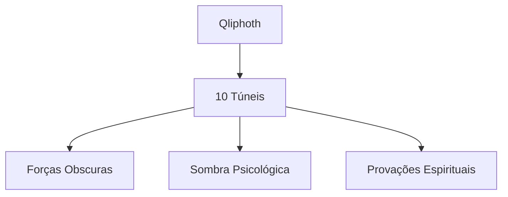

# 🌑 Os Túneis da Qliphoth

Os **Túneis da Qliphoth** representam as **10 esferas invertidas** que compõem a Árvore da Morte ou Árvore do Conhecimento do Bem e do Mal. Cada túnel corresponde a um Sefirah da Árvore da Vida, mas em sua **forma obscura e distorcida**.

## 📊 Mapa dos 10 Túneis

| 🌑 Túnel | 🔥 Nome | ⚖️ Sefirah Correspondente | 🎭 Aspecto Principal |
|---------|---------|--------------------------|---------------------|
| **1** | Thaumiel | Kether | Dualidade Destrutiva |
| **2** | Ghagiel | Chokmah | Insanidade e Confusão |
| **3** | Satariel | Binah | Negação e Ocultação |
| **4** | Gamchicoth | Chesed | Materialismo Excessivo |
| **5** | Golachab | Geburah | Crueldade e Destruição |
| **6** | Thagirion | Tiphereth | Conflito e Sofrimento |
| **7** | Gha'agsheblah | Netzach | Desejo Descontrolado |
| **8** | Sathariel | Hod | Ilusão e Engano |
| **9** | Ghagiel | Yesod | Inércia e Estagnação |
| **10** | Lilith | Malkuth | Manifestação Terrena |

---

## 🔍 Características Gerais dos Túneis

### 🌪️ **Natureza dos Túneis**
- **Caminhos de sombra** e escuridão
- **Forças fragmentadas** da criação
- **Aspectos negados** da psique
- **Desafios kármicos** a serem superados

### 🧭 **Propósito Espiritual**
- **Revelar** aspectos ocultos do ser
- **Testar** e fortalecer o buscador
- **Integrar** a sombra pessoal
- **Transformar** energias negativas

---

## 🗺️ Sumário dos Túneis

### 1. **Thaumiel** ⚡
- **"Os Gêmeos de Deus"**
- **Corrupção da unidade** em dualidade conflituosa
- **Demônios**: Moloch e Satan
- **Desafio**: Superar a divisão interna

### 2. **Ghagiel** 🕳️
- **"Os Obstaculizadores"**
- **Confusão mental** e perda de propósito
- **Demônio**: Beelzebub
- **Desafio**: Manter o foco na escuridão

### 3. **Satariel** 🎭
- **"A Ocultação de Deus"**
- **Cegueira espiritual** e negação da verdade
- **Demônio**: Lucifuge
- **Desafio**: Enxergar além das ilusões

### 4. **Gamchicoth** 💰
- **"Os Devoradores"**
- **Materialismo** e apego excessivo
- **Demônio**: Astaroth
- **Desafio**: Transcender a matéria

### 5. **Golachab** 🔥
- **"Os Incendiários"**
- **Raiva destrutiva** e fanatismo
- **Demônio**: Asmodeus
- **Desafio**: Transformar fúria em força

### 6. **Thagirion** ⚔️
- **"Os Contempladores"**
- **Conflito interno** e sofrimento existencial
- **Demônio**: Belphegor
- **Desafio**: Encontrar significado no caos

### 7. **Gha'agsheblah** 🌊
- **"Os Fetichistas"**
- **Desejos obsessivos** e vícios
- **Demônio**: Baal
- **Desafio**: Dominar as paixões

### 8. **Sathariel** 🎪
- **"A Ocultação de Deus"**
- **Engano** e auto-ilusão
- **Demônio**: Adramalech
- **Desafio**: Romper com mentiras

### 9. **Ghagiel** 🕸️
- **"Os Obstaculizadores"**
- **Estagnação** e inércia espiritual
- **Demônio**: Lilith
- **Desafio**: Movimentar-se na escuridão

### 10. **Lilith** 🌙
- **"A Noite"**
- **Manifestação terrena** das sombras
- **Demônio**: Naamah
- **Desafio**: Integrar sombra na realidade

Todos os túneis possuem um documento referente a sua pesquisa aprofundada neste diretório

---

## ⚠️ Advertências Importantes

### 🛡️ **Precauções Necessárias**
- **Preparação espiritual** é essencial
- **Conhecimento prévio** da Cabala tradicional
- **Proteções energéticas** adequadas
- **Orientação experiente** recomendada

### 💫 **Abordagens Recomendadas**
- **Estudo teórico** antes da prática
- **Meditação gradual** sobre cada túnel
- **Registro** em diário espiritual
- **Integração psicológica** das sombras
