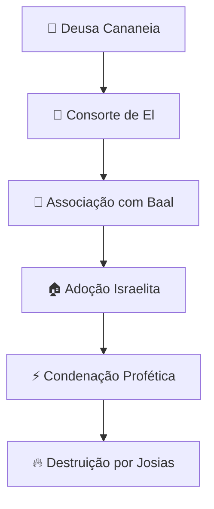

# 🌿 Aserá: A Deusa-Mãe Cananeia

## 🌳 Visão Geral

Aserá (também conhecida como **Ashtoreth, Asherah**) foi a principal deusa cananeia da **fertilidade, maternidade e natureza**, consorte do deus El e posteriormente associada a Baal. Sua adoração foi um dos principais desafios à fé israelita, com repetidas condenações na Bíblia por sua influência sincrética.

> 📜 *"Não plantarás nenhum poste sagrado de nenhum tipo de madeira ao lado do altar que construíres para o SENHOR, o teu Deus"* - **Deuteronômio 16:21**

## 🏺 Origem e Significado

### 📍 Procedência
- **🌍 Origem cananeia/fenícia**
- **📅 Período**: Idade do Bronze (aproximadamente 2000-1200 a.C)
- **📍 Centros principais**: Ugarite, Sidom, Tiro, Israel

### 🔤 Etimologia
O nome "Aserá" possui múltiplas origens:
- **📝 Hebraico**: "Asherah" (אֲשֵׁרָה) - significado incerto
- **🔠 Ugarítico**: "Athirat" - "a que anda no mar"
- **🔄 Possível relação** com a raiz "ashar" (feliz, abençoado)

## 📖 Citações Bíblicas

### 📚 Antigo Testamento

| **Passagem** | **Contexto** | **Significado** |
|--------------|------------|-----------------|
| 📜 1 Reis 18:19 | 400 profetas de Aserá com Jezabel | Influência estrangeira |
| 📜 2 Reis 23:4 | Josias destrói objetos de Aserá | Reforma religiosa |
| 📜 Juízes 3:7 | Israel serve a Baal e Aserá | Ciclo de apostasia |
| 📜 2 Crônicas 15:16 | Mãe do rei Asa remove imagem | Purificação do culto |

### ⚔️ A Reforma de Josias
- **📍 Local**: Templo de Jerusalém
- **🔥 Ação**: Queima de objetos de Aserá
- **👑 Motivador**: Rei Josias
- **📜 Base**: Lei mosaica contra idolatria

## 🌍 Povos que Adoravam Aserá

| **Povo** | **Região** | **Características do Culto** |
|----------|------------|------------------------------|
| **Cananeus** | Canaã | Deusa-mãe original |
| **Fenícios** | Fenícia | Culto como Astarte |
| **Israelitas** | Israel | Adoção sincrética problemática |
| **Amonitas** | Jordânia | Assimilação cultural |

## 🏛️ Características do Culto a Aserá

### 🌸 Atributos Divinos

| **Atributo** | **Significado** | **Símbolos** |
|-------------|---------------|----------------|
| 🌿 Deusa da Natureza | Fertilidade da terra | 🌳 Árvores, postes sagrados |
| 👶 Deusa da Maternidade | Proteção às crianças | 🤱 Figurinhas femininas |
| 💧 Deusa da Vida | Renovação e crescimento | 💦 Fontes, rios |
| 🌙 Deusa Lunar | Ciclos naturais | 🌒 Lua crescente |

### 🗿 Representação Física
- **🌳 Poste sagrado** de madeira (Asherah)
- **👩 Figura feminina** com seios nus
- **🌿 Guirlandas** de flores e frutas
- **🐍 Serpentes** (símbolo de renovação)

### 🏺 Locais de Culto
- **🌲 Bosques sagrados**: Árvores dedicadas
- **⛰️ Lugares altos**: Santuários em colinas
- **🏠 Altares domésticos**: Culto familiar
- 💦 **Fontes naturais**: Locais de peregrinação

## 🔥 Rituais e Práticas

### 🎉 Cerimônias Principais

| **Ritual** | **Propósito** | **Participantes** |
|------------|---------------|-------------------|
| 🌸 Festivais de Primavera | Fertilidade agrícola | Comunidade inteira |
| 👶 Ritos de Nascimento | Proteção aos recém-nascidos | Mulheres e parteiras |
| 💃 Danças Rituais | Invocação da fertilidade | Sacerdotisas |
| **🌿 Oferecimentos vegetais** | Agradecimento pelas colheitas | Agricultores |

### 👥 Sacerdócio e Participantes
- **👩 Sacerdotisas**: Mulheres dedicadas ao culto
- **💃 Profetisas**: Mulheres com dons espirituais
- **👨‍👩‍👧‍👦 Participação familiar**: Culto doméstico
- **👑 Patrocínio real**: Rainhas como Jezabel

## 🔍 Evidências Arqueológicas

### 🏺 Descobertas Importantes

| **Sítio** | **Descoberta** | **Significado** |
|-----------|----------------|-----------------|
| 🎨 Kuntillet Ajrud | Inscrição "Yahweh e sua Aserá" | Sincretismo israelita |
| 🏛️ Tell es-Safi | Figurinhas de fertilidade | Culto doméstico |
| 📜 Ugarite | Textos mitológicos | Panteão cananeu |
| 🌳 Hazor | Postes sagrados | Práticas rituais |

### 🎯 Inscrições Controversas
- **📝 "Yahweh de Samaria e sua Aserá"**
- **📝 "Yahweh de Teman e sua Aserá"**
- **🔄 Debate acadêmico**: Aserá como consorte de Yahweh?
- **⚡ Implicações**: Monolatria vs. Monoteísmo

## ⚖️ Perspectivas Teológicas

### 🙏 Visão Judaico-Cristã
- **🎭 Símbolo da idolatria cananeia**
- **💔 Corrupção do culto a Yahweh**
- **⚠️ Ameaça à aliança mosaica**
- **🔥 Alvo das reformas proféticas**

### 🔄 Significado Simbólico
- 🌿 **Tentação do naturalismo** religioso
- 💞 **Atração pela fertilidade** imediata
- 👥 **Papéis de gênero** no culto antigo
- 🏠 **Tensão entre fé doméstica e oficial**

## 🔄 Evolução Histórica

### 📈 Desenvolvimento do Culto

### 👑 Períodos de Influência
- **📜 Período dos Juízes**: Adoção esporádica
- **👑 Monarquia Unida**: Tolerância relativa
- **🏰 Reino do Norte**: Aceitação generalizada
- **⚖️ Período dos Reis**: Condenação crescente

## 🎭 Legado Cultural e Influência

### 📚 Na Literatura e Artes
- **📖 Bíblia**: Símbolo recorrente de apostasia
- **🎨 Arte medieval**: Representação como idolatria
- **📚 Literatura feminista**: Rediscovery como divindade
- **🎭 Movimento neopagão**: Recriação do culto

### 🌐 Influência na Cultura Contemporânea
- **🌿 Movimento ecofeminista**: Símbolo da natureza
- **🎵 Música espiritual**: Referências femininas
- **📚 Estudos de gênero**: Papéis religiosos femininos
- **🌍 Reconstrucionismo pagão**: Revivificação do culto

## 💭 Reflexão Final e Lições

### ⚠️ Lições Contemporâneas
Aserá representa a **tensão perene entre espiritualidade oficial e práticas populares**, e o **desejo humano por divindades acessíveis e maternas**.

### 🌿 Significado Atual
A história de Aserá oferece **reflexões profundas** sobre:
- A **necessidade humana** por divindades tangíveis
- O **conflito entre tradição e adaptação** religiosa
- Os **papéis de gênero** na expressão espiritual
- A **eterna tentação** do sincretismo religioso

### 🌳 O Símbolo da Árvore
O poste sagrado de Aserá permanece como **metáfora poderosa** de:
- 🌱 **Crescimento espiritual** vs. idolatria
- 🏠 **Fé doméstica** vs. religião oficial
- 💞 **Maternidade divina** vs. paternidade celestial
- 🌍 **Conexão natural** vs. transcendência

---

> 📌 **Nota Final**: Aserá permanece como um dos exemplos mais complexos de interação religiosa na antiga Israel, representando tanto os perigos da idolatria quanto as legítimas buscas humanas por uma dimensão feminina do divino. Sua história desafia compreensões simplistas da evolução religiosa israelita.