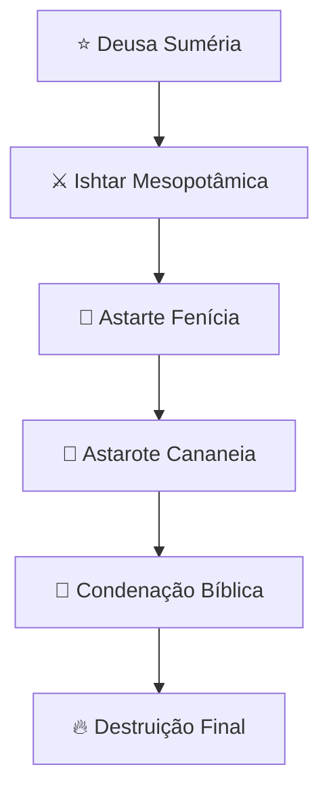

# 👑 Astarote: A Deusa da Guerra e Amores Proibidos

## ⚔️ Visão Geral

Astarote (também conhecida como **Astarte, Ashtoreth, Ishtar**) foi uma das principais deusas das religiões cananeias, fenícias e mesopotâmicas, associada à **guerra, amor, fertilidade e sexualidade**. Como deusa da guerra e do amor sensual, representava os extremos da paixão humana - tanto a destruição da batalha quanto os prazeres da carne.

> 📜 *"Tambeles abandonaram o SENHOR e o sirviram a Baal e a Astarote."* - **Juízes 2:13**

## 🏺 Origem e Significado

### 📍 Procedência
- **🌍 Origem mesopotâmica** (como Ishtar)
- **📅 Período**: Idade do Bronze (aproximadamente 2500-1200 a.C)
- **📍 Adoção posterior** por cananeus e fenícios

### 🔤 Etimologia
O nome "Astarote" possui evolução complexa:
- **📝 Hebraico**: "Ashtoreth" (עַשְׁתֹּרֶת) - forma plural de desprezo
- **🔠 Acádio**: "Ishtar" - rainha das estrelas
- **🔄 Adaptação grega**: "Astarte" - versão helenizada

## 📖 Citações Bíblicas

### 📚 Antigo Testamento

| **Passagem** | **Contexto** | **Significado** |
|--------------|------------|-----------------|
| 📜 1 Reis 11:5 | Salomão segue Astarote | Apostasia real |
| 📜 Juízes 2:13 | Israel abandona Deus | Ciclo de idolatria |
| 📜 1 Samuel 7:3-4 | Israel remove Astarote | Arrependimento nacional |
| 📜 2 Reis 23:13 | Josias destrói altares | Reforma religiosa |

### 👑 A Queda de Salomão
- **💔 Casamento** com mulheres estrangeiras
- **🛐 Construção** de altares pagãos
- **⚡ Consequência**: Divisão do reino
- **📉 Legado**: Mancha na história real

## 🌍 Povos que Adoravam Astarote

| **Povo** | **Região** | **Características do Culto** |
|----------|------------|------------------------------|
| **Mesopotâmicos** | Suméria/Acad | Como Ishtar, deusa suprema |
| **Cananeus** | Canaã | Deusa da guerra e amor |
| **Fenícios** | Fenícia | Culto como Astarte |
| **Israelitas** | Israel | Adoção sincrética condenada |
| **Egípcios** | Egito | Assimilação como divindade |

## 🏛️ Características do Culto a Astarote

### ⚖️ Dupla Natureza Divina

| **Aspecto** | **Manifestação** | **Símbolos** |
|-------------|---------------|----------------|
| ⚔️ Deusa da Guerra | Destruição e conquista | 🛡️ Espada, leão |
| 💞 Deusa do Amor | Paixão e sensualidade | 🌹 Rosa, estrela |
| 👶 Deusa da Fertilidade | Maternidade e nascimento | 🌙 Lua, pomba |
| ✨ Deusa Estelar | Corpos celestes | ⭐ Vênus, estrelas |

### 🗿 Representação Física
- **👸 Mulher guerreira** com armas
- **🌺 Figurinhas** de fertilidade com seios nus
- **👑 Coroa com chifres** ou estrelas
- **🐍 Serpentes** nas mãos (renovação)

### 🏺 Locais de Culto
- **⚔️ Templos de guerra** para batalhas
- **💒 Santuários de amor** para casamentos
- **🌳 Bosques sagrados** para ritos de fertilidade
- **🏔️ Lugares altos** para observação estelar

## 🔥 Rituais e Práticas

### 🎭 Cerimônias Controversas

| **Ritual** | **Propósito** | **Participantes** |
|------------|---------------|-------------------|
| 💃 Prostituição Sagrada | Fertilidade e abundância | Sacerdotisas e devotos |
| 🎪 Festivais Sensuais | Celebração do amor físico | Comunidade inteira |
| ⚔️ Ritos Bélicos | Vitória em batalhas | Guerreiros e reis |
| 🌟 Observações Astronômicas | Adoração estelar | Sacerdotes astrólogos |

### 👥 Estrutura Sacerdotal
- **👩 Sacerdotisas** dedicadas ao amor sagrado
- **⚔️ Sacerdotes guerreiros** para ritos marciais
- **🔮 Profetisas** para oráculos
- **🎵 Músicos** para cerimônias

## 🔍 Evidências Arqueológicas

### 🏺 Descobertas Importantes

| **Sítio** | **Descoberta** | **Datação** |
|-----------|----------------|-------------|
| 🎨 Ugarite | Textos mitológicos completos | 1300 a.C |
| 🏛️ Biblos | Templo de Astarte | 1800 a.C |
| 📜 Ebla | Tabletes com referências | 2500 a.C |
| 🗿 Cartago | Estelas de sacrifícios | 800 a.C |

### 🌟 O Planeta Vênus
- **⭐ Estrela da Manhã/Tarde** associada a Astarote
- **📊 Cálculos astronômicos** precisos
- **🎯 Ciclos de 8 anos** no culto
- **🌅 Nascente e poente** como manifestações duais

## ⚖️ Perspectivas Teológicas

### 🙏 Visão Judaico-Cristã
- **🎭 Símbolo da apostasia israelita**
- **💔 Corrupção da sexualidade sagrada**
- **⚔️ Glorificação da violência**
- **🔥 Representação da idolatria sensual**

### 🔄 Significado Simbólico
- 🌗 **Dualidade perigosa** da natureza humana
- 💞 **Sexualidade distorcida** do propósito divino
- ⚔️ **Glorificação** da guerra e conflito
- ✨ **Adoração da criação** em vez do Criador

## 👺 A Verdadeira Identidade Espiritual

### 😈 Anjo Caído Disfarçado
Como todos os falsos deuses, Astarote era:
- **👺 Entidade demoníaca** se passando por divindade
- 💡 **Anjo de luz** enganador (2 Coríntios 11:14)
- 🎭 **Personagem fictício** com poder demoníaco
- ⚡ **Ser caído** usando adoração ilegítima

### 🚫 Por que é Idolatria?
- **🚫 Desvia** adoração do Deus verdadeiro
- 💀 **Associada** a práticas abomináveis
- 👹 **Representa** principados das trevas
- 📜 **Condenada** repetidamente nas Escrituras

## 🔄 Evolução Histórica

### 📈 Desenvolvimento do Culto

### 👑 Períodos de Influência em Israel
- **📜 Período dos Juízes**: Adoção cíclica
- **👑 Reis Unidos**: Tolerância perigosa
- 🏰 **Reino Dividido**: Prática generalizada
- **⚖️ Período Exílico**: Julgamento divino

## 🎭 Legado Cultural e Influência

### 📚 Na Literatura e Artes
- **📖 "Epopéia de Gilgamesh"** - Ishtar como antagonista
- 🎨 **Arte clássica** - Vênus/Afrodite como herdeira
- **📚 Literatura medieval** - demonização cristã
- 🎭 **Obras renascentistas** - reinterpretação mitológica

### 🌐 Influência na Cultura Contemporânea
- 🌟 **Astrologia moderna** - planeta Vênus
- 💖 **Cultura de romance** - idealização do amor
- ⚔️ **Feminismo radical** - símbolo de poder feminino
- 🎵 **Música e arte** - referências mitológicas

## 💭 Reflexão Final e Lições

### ⚠️ Lições Contemporâneas
Astarote representa a **sutil tentação de espiritualidades que glorificam paixões humanas** em vez de buscar a santidade divina.

### ⚔️ Significado Atual
A história de Astarote ensina sobre:
- O **perigo de espiritualidades** que validam every desejo humano
- A **importância da santidade** sexual no plano divino
- A **necessidade de discernimento** entre amor sagrado e profano
- O **conflito eterno** entre adoração verdadeira e idolatria emocional

### 💞 O Amor Verdadeiro vs. Paixão Idólatra
Astarote permanece como **símbolo do que acontece quando**:
- ❤️ **O amor é separado** do compromisso e santidade
- ⚔️ **O poder é celebrado** sem responsabilidade moral
- 🌟 **A criação é adorada** em vez do Criador
- 🎭 **A espiritualidade serve** aos desejos em vez de transformá-los

---

> ⚠️ **Alerta Espiritual**: Astarote representa a sofisticada tentação de criar deuses à nossa própria imagem - divindades que justificam nossas paixões em vez de nos chamar à santidade. Sua história serve como alerta eterno contra espiritualidades que buscam validar em vez de transformar o coração humano.

**🎯 Propósito deste Estudo**: Compreender as raízes da idolatria sensual para guardar nosso coração contra formas modernas de adoração que elevam paixões humanas ao status de virtudes espirituais.