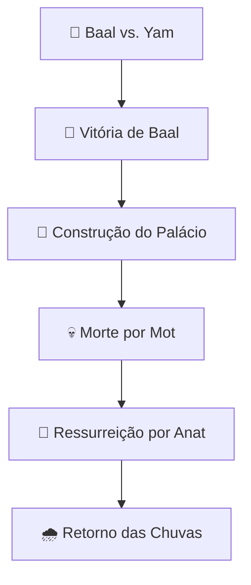

# 🌾 Baal: O Senhor da Tempestade e da Fertilidade

## 🌪️ Visão Geral

Baal (também conhecido como **Ba'al, Bel ou Bael**) foi uma das principais divindades das religiões cananeias e fenícias, associado às **tempestades, chuva, fertilidade e agricultura**. Como deus do clima, era considerado responsável pela prosperidade e sobrevivência das civilizações antigas.

> 📜 *"E sucedeu que, pela manhã, o sol nasceu sobre o exército, e eis que os moabitas viram defronte deles as águas vermelhas como sangue."* - **2 Reis 3:22** (contexto de batalha contra adoradores de Baal)

## 🏺 Origem e Significado

### 📍 Procedência
- **🌍 Origem cananeia/fenícia**
- **📅 Período**: Idade do Bronze (aproximadamente 3000-1200 a.C)
- **📍 Centros principais**: Ugarite, Fenícia, Cartago

### 🔤 Etimologia
O nome "Baal" deriva:
- **📝 Hebraico**: "Ba'al" (בַּעַל) - significa "senhor" ou "marido"
- **🔠 Ugarítico**: "B'l" - título de autoridade
- **🔄 Título genérico** usado para várias divindades locais

## 📖 Citações Bíblicas

### 📚 Antigo Testamento

| **Passagem** | **Contexto** |
|--------------|----------------|
| 📜 1 Reis 18 | Elias confronta os profetas de Baal no Monte Carmelo |
| 📜 Juízes 6 | Gideão destrói altar de Baal |
| 📜 Jeremias 23:13 | Condenação aos profetas de Baal em Samaria |
| 📜 Oséias 2:8 | Acusação de Israel por adorar Baal |

### ⚔️ O Confronto no Monte Carmelo
- **📍 Local**: Monte Carmelo, Israel
- **👤 Protagonistas**: Profeta Elias vs. 450 profetas de Baal
- **🔥 Desfecho**: Fogo de Deus consome o holocausto de Elias
- **💀 Resultado**: Execução dos profetas de Baal

## 🌍 Povos que Adoravam Baal

| **Povo** | **Região** | **Características do Culto** |
|----------|------------|------------------------------|
| **Cananeus** | Canaã | Culto original como deus da tempestade |
| **Fenícios** | Fenícia | Divindade nacional principal |
| **Cartagineses** | Norte da África | Aníbal como devoto de Baal-Hamon |
| **Israelitas** | Israel | Adoção sincrética, condenada pelos profetas |
| **Babilônios** | Mesopotâmia | Assimilado como Bel |

## 🏛️ Características do Culto a Baal

### ⛈️ Atributos Divinos

| **Atributo** | **Significado** | **Símbolos** |
|-------------|---------------|----------------|
| 🌩️ Deus da Tempestade | Controlava chuvas e trovões | ⚡ Raio, trovão |
| 🌾 Deus da Fertilidade | Garantia colheitas abundantes | 🌽 Espiga, touro |
| 👑 Deus Guerreiro | Protegia o povo em batalhas | 🛡️ Lança, escudo |
| 💧 Deus das Águas | Controlava fontes e rios | 💦 Ondas, nuvens |

### 🗿 Representação Física
- **🤴 Figura masculina** robusta
- **🐂 Chifres de touro** (símbolo de força)
- **⚡ Raio na mão** direita
- **👑 Elmo cônico** com chifres

### 🏺 Locais de Culto
- **Alto**s: Santuários em colinas e montanhas
- **Bosques**: Áreas arborizadas sagradas
- **Templos**: Estruturas dedicadas em cidades
- **Pedras** sagradas (masseboth)

## 🔥 Rituais e Práticas

### 🎉 Cerimônias Principais

| **Ritual** | **Propósito** | **Características** |
|-------------|---------------|----------------|
| 🎪 Festivais Sazonais | Garantir fertilidade | Danças, procissões |
- **🐄 Sacrifícios Animais** | Apaziguar a divindade | Touros, cordeiros |
| 🙌 Orações por Chuva | Prevenir secas | Rituais no alto dos montes |
| 💃 Ritos de Fertilidade | Assegurar prosperidade | Práticas sexuais rituais |

### ⚠️ Práticas Controversas
- **🔥 Sacrifícios humanos** (em algumas regiões)
- **💏 Prostituição cultual** masculina e feminina
- **🗣️ Autoflagelação** em rituais extáticos

## 🔄 Mitologia e Panteão

### 👨‍👩‍👧‍👦 Família Divina
- **👑 Pai**: El (deus supremo cananeu)
- **👩 Mãe**: Asherah (deusa-mãe)
- **👭 Irmã**: Anat (deusa da guerra)
- **👫 Consorte**: Astarte/Asherah

### 📖 Ciclo Mitológico Principal

## 🔍 Evidências Arqueológicas

### 🏺 Descobertas Importantes
- **📜 Textos de Ugarite** - mitologia detalhada
- **🗿 Estelas** com representações de Baal
- **💍 Amuletos e selos** com iconografia
- **🏛️ Templos** dedicados em Hazor e Megido

### 🎯 Inscrições Significativas
- **📝 Tabletes de Ugarite** (século XIV a.C)
- **🗣️ Inscrições fenícias** em sarcófagos
- **🏺 Cerâmica ritual** com invocações

## ⚖️ Perspectivas Teológicas

### 🙏 Visão Judaico-Cristã
- **🎭 Principal rival de Yahweh**
- **⚠️ Símbolo da idolatria cananeia**
- **💔 Causa de apostasia israelita**
- **🔥 Alvo da reforma profética**

### 🔄 Significado Simbólico
- **🌪️ Forças naturais personificadas**
- **🌾 Dependência agrícola antiga**
- **💼 Luta pelo monoteísmo**
- **⚔️ Conflito cultural e religioso**

## 🎭 Legado Cultural e Influência

### 📚 Na Literatura e Artes
- **📖 "A Bíblia"** - antagonista frequente
- **🎭 Literatura clássica** - referências mitológicas
- **🖼️ Arte renascentista** - representações do demônio
- **📚 Ocultismo** - entidade em grimórios

### 🌐 Influência na Cultura Contemporânea
- **🎵 Música** - referências no metal e rock
- **🎮 Games** - personagem em RPGs e videogames
- **📺 Séries e filmes** - figura demoníaca
- **🧠 Psicologia** - arquétipo do poder destrutivo

## 💭 Reflexão Final e Lições

### ⚠️ Lições Contemporâneas
Baal representa a **tentação constante do sincretismo religioso** e a **luta entre fé e pragmatismo** nas sociedades antigas.

### 🌪️ Significado Atual
A figura de Baal serve como **reflexão sobre**:
- A **eterna busca por segurança** através do controle do ambiente
- O **perigo da assimilação cultural** que compromete valores fundamentais
- A **tensão entre tradição e adaptação**
- O **valor da fidelidade religiosa** em contextos plurais

---

> 📌 **Nota Final**: Baal permanece como um dos exemplos mais vívidos de como as divindades antigas refletiam as necessidades, medos e aspirações das civilizações que as cultuavam, e como sua memória continua a influenciar nossa compreensão do desenvolvimento religioso humano.