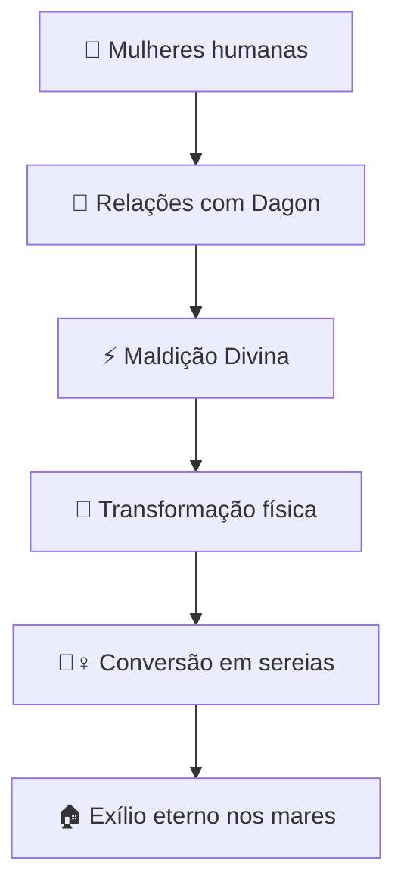

# 🐟 Dagon: O Senhor dos Mares

## 🌊 Visão Geral

Dagon (também conhecido como **Dagan**) foi uma divindade mesopotâmica originalmente associada à **fertilidade e agricultura**, que posteriormente evoluiu para um **deus do mar** entre os filisteus. A tradição secreta revela que Dagon era originalmente um **Nefilim** - um gigante da antiguidade - cuja aparência imponente levou os povos antigos a venerá-lo como divindade.

> 📜 *"Porque os filisteus tomaram a arca de Deus, e a levaram de Ebenézer a Asdode. Tomaram os filisteus a arca de Deus, e a puseram na casa de Dagom, e a puseram junto a Dagom."* - **1 Samuel 5:1-2**

## 🏺 Origem e Significado

### 📍 Procedência
- **🌍 Origem mesopotâmica inicial**
- **📅 Período**: Antigo Império Acadiano (c. 2334-2154 a.C)
- **📍 Adoção posterior** pelos filisteus como deus principal

### 🔤 Etimologia
O nome "Dagon" possui dupla origem:
- **📝 Hebraico**: "Dag" (דָּג) - significa "peixe"
- **🔠 Acadiano**: "Dagan" - relacionado a "grão" ou "nuvem"
- **🔄 Dupla identidade**: divindade agrícola e marítima

## 👹 A Verdadeira Origem: Dagon como Nefilim

### 🗿 A Natureza Gigantesca

| **Característica** | **Descrição** | **Evidências** |
|-------------------|---------------|----------------|
| 📏 Estatura colossal | 3-4 metros de altura | 📖 Tradições antigas |
| **💪 Força sobrenatural** | Capacidades sobre-humanas | 🏺 Relatos históricos |
| 🧠 Longevidade extrema | Vida de séculos | 📜 Textos apócrifos |
| 👑 Aparência régia | Features majestosas | 🎨 Representações antigas |

### 🌊 A Maldição das Mulheres

#### 🧜‍♀️ A Origem das Sereias
- **🔮 Transformação gradual**: Membros inferiores fundindo-se
- **🐟 Desenvolvimento de nadadeiras** e escamas
- **🌊 Condenação ao habitat marinho**
- 🎵 **Habilidades vocais** aprimoradas como efeito colateral
- **💔 Isolamento eterno** da sociedade humana

## 📖 Citações Bíblicas

### 📚 Antigo Testamento

| **Passagem** | **Evento** | **Significado** |
|--------------|------------|-----------------|
| 📜 1 Samuel 5:1-7 | Arca na casa de Dagon | Estátua de Dagon derrubada |
| 📜 Juízes 16:23 | Sacrifícios a Dagon | Celebração filisteia |
| 📜 1 Crônicas 10:10 | Cabeça de Saul no templo | Desprezo aos israelitas |
| 📜 Josué 15:41 | Cidade de Bete-Dagom | Influência territorial |

### ⚔️ O Incidente com a Arca
- **📍 Local**: Templo de Dagon em Asdode
- **🛐 Profanação**: Arca colocada junto à estátua
- **💥 Milagre**: Estátua caída e despedaçada
- **⚡ Julgamento**: Pragas sobre os filisteus

## 🌍 Povos que Adoravam Dagon

| **Povo** | **Região** | **Período** | **Características** |
|----------|------------|-------------|---------------------|
| **Acadianos** | Mesopotâmia | 2334-2154 a.C | Deus da fertilidade |
| **Amoritas** | Síria | 2000-1600 a.C | Divindade principal |
| **Filisteus** | Canaã | 1200-600 a.C | Deus nacional |
| **Fenícios** | Fenícia | 1500-300 a.C | Culto marítimo |

## 🏛️ Características do Culto a Dagon

### 🌾 Dupla Natureza do Culto

#### 🏺 Período Mesopotâmico
- **🌾 Deus da agricultura** e grãos
- **☁️ Associado a nuvens** e chuva
- **🌱 Fertilidade** das colheitas

#### 🌊 Período Filisteu
- **🐟 Deus marinho** com torso humano e cauda de peixe
- 🌊 **Senhor dos mares** e navegação
- ⚓ **Protetor dos pescadores** e marinheiros

### 🗿 Representação Física

| **Período** | **Forma** | **Símbolos** |
|-------------|-----------|--------------|
| 🏛️ Mesopotâmico | Humano com trajes reais | 🌾 Espigas de grãos |
| 🌊 Filisteu | Híbrido homem-peixe | 🐟 Escamas, tridente |
| 🎭 Sincrético | Torso humano, cauda de peixe | 👑 Coroa, cetro |

### 🏺 Locais de Culto Principais
- **🏛️ Templo de Asdode**: Principal santuário filisteu
- **🏰 Templo de Gaza**: Local de celebrações
- **🌊 Altares costeiros**: Para pescadores e marinheiros
- **🏞️ Templos mesopotâmicos**: Em cidades principais

## 🔥 Rituais e Práticas

### 🎉 Cerimônias e Sacrifícios

| **Ritual** | **Propósito** | **Participantes** |
|------------|---------------|-------------------|
| **🎣 Festival da Pesca** | Abundância marítima | Pescadores |
| 🌾 Rito de Plantio | Boas colheitas | Agricultores |
| ⚔️ Celebrações de Vitória | Agradecimento bélico | Guerreiros |
| 🐟 Sacrifícios de Peixes | Purificação | Sacerdotes |

### ⚠️ Práticas Secretas
- **👥 Rituais de fertilidade** com descendentes
- **🌊 Cerimônias noturnas** à beira-mar
- **🎵 Invocações musicais** às sereias
- **🐚 Oferecimentos** de conchas e pérolas

## 🔍 Evidências Arqueológicas e Históricas

### 🏺 Descobertas Importantes

| **Sítio** | **Descoberta** | **Datação** |
|-----------|----------------|-------------|
| 🏛️ Tell es-Safi | Templo filisteu | 1000 a.C|
| 🎨 Mari (Síria) | Estátuas e inscrições | 1800 a.C |
| **📜 Ugarite** | Textos mitológicos | 1300 a.C |
| 🐟 Asdode | Representações híbridas | 900 a.C |

### 🎯 Evidências da Natureza Nefilim
- **📏 Esqueletos gigantes** descobertos na região filisteia
- **🎨 Afrescos antigos** mostrando seres híbridos
- **📝 Manuscritos** descrevendo "homens-peixe"
- **🏺 Baixos-relevos** com figuras sobre-humanas

## ⚖️ Perspectivas Teológicas

### 🙏 Visão Judaico-Cristã
- **🎭 Divindade falsa** e demoníaca
- **⚡ Símbolo da oposição** a Yahweh
- **💀 Associação com gigantes** antigos
- 🌊 **Representação do caos** primordial

### 🔄 Significado Simbólico
- 🐟 **Hibridismo** espiritual e moral
- 👹 **Consequências** da idolatria
- 💔 **Degradação** das relações divino-humanas
- 🌊 **Perigo** do sincretismo religioso

## 🎭 Legado Cultural e Mitológico

### 🧜‍♀️ A Conexão com as Sereias

#### 📖 Desenvolvimento da Lenda
- **🎵 Canto sedutor**: Eco das invocações antigas
- **🐟 Forma híbrida**: Lembrança da transformação
- **🌊 Habitat marinho**: Resultado da maldição
- 💔 **Natureza trágica**: Reflexo do exílio eterno

### 📚 Na Literatura e Artes
- **📖 "Paradise Lost" (Milton)**: Dagon como demônio
- 🎨 **Arte medieval**: Representações demoníacas
- **📚 Ocultismo**: Entidade em grimórios
- 🎬 **Cinema moderno**: Figura lovecraftiana

### 🌐 Influência na Cultura Contemporânea
- 🎵 **Música**: Bandas de metal e folk
- 🎮 **Games**: Chefes em RPGs e aventuras
- 📚 **Literatura horror**: H.P. Lovecraft
- 🎭 **Folclore marinho**: Lendas costeiras

## 💭 Reflexão Final e Lições

### ⚠️ Lições Contemporâneas
Dagon representa o **perigo da veneração do poder físico** e as **consequências trágicas do sincretismo religioso** que mistura o divino com o abominável.

### 🌊 Significado Atual
A história de Dagon serve como **alerta eterno** sobre:
- Os **perigos da idolatria** e veneração de seres caídos
- As **consequências irreversíveis** do pecado organizado
- A **natureza degradante** do sincretismo religioso
- O **valor da pureza** nas relações divino-humanas

### 🧜‍♀️ O Legado das Sereias
As lendas das sereias permanecem como **lembretes viventes** das consequências de:
- **💞 Relações ilícitas** entre diferentes ordens de seres
- **⚡ Desobediência** às leis divinas
- **🌊 Exílio espiritual** resultante do pecado
- 💔 **Eterna separação** da comunidade dos fiéis

---

> 📌 **Nota Final**: Dagon permanece como um dos exemplos mais vívidos de como seres caídos podem ser elevados ao status divino pela ignorância humana, e como as consequências do pecado podem ecoar através dos séculos, manifestando-se até mesmo em nosso folclore e mitologia contemporâneos. Sua história serve como alerta permanente contra a mistura do sagrado com o profano.
