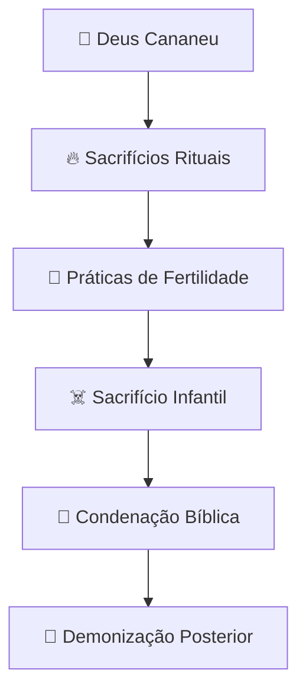

# 🔥 Moloque: O deus do Fogo e dos Sacrifícios

## 🌋 Visão Geral

Moloque (também grafado como **Molech, Moloch ou Milcom**) foi uma divindade cananeia associada ao **fogo, sacrifícios e fertilidade**, conhecido principalmente pelos **sacrifícios de crianças** que lhe eram oferecidos. Sua adoração é repetidamente condenada na Bíblia Hebraica como uma das práticas mais abomináveis.

> 📜 *"E profanou a Topete, que está no vale de Ben-Hinom, para que ninguém fizesse passar a seu filho ou a sua filha pelo fogo em honra de Moloque."* - **2 Reis 23:10**

## 🏺 Origem e Significado

### 📍 Procedência
- **🌍 Origem cananeia/amonita**
- **📅 Período**: Idade do Bronze e Ferro (aproximadamente 2000-500 a.C)
- **📍 Culto predominante** no Levante, especialmente em Amom

### 🔤 Etimologia
O nome "Moloque" derva provavelmente da palavra:
- **📝 Hebraico**: "Molech" (מֹלֶךְ)
- **🔠 Fenício**: "Molk" - que significa "sacrifício"
- **🔄 Possível relação** com a raiz semítica "mlk" (reinar)

## 📖 Citações Bíblicas

### 📚 Antigo Testamento

| **Passagem** | **Condenação** |
|--------------|----------------|
| 📜 Levítico 18:21 | "Não entregarás teus filhos para serem sacrificados a Moloque" |
| 📜 2 Reis 23:10 | Josias destrói locais de culto a Moloque |
| 📜 Jeremias 32:35 | Condena a construção de altares no Vale de Hinom |
| 📜 Amós 5:26 | Associação com astros e ídolos |

### 🏞️ O Vale de Hinom (Geena)
- **📍 Localização**: Sul de Jerusalém
- **🔥 Cenário principal** dos sacrifícios
- **🗑️ Posteriormente usado** como lixeira
- **☠️ Origem do conceito** de "Geena" como inferno

## 🌍 Povos que Adoravam Moloque

| **Povo** | **Região** | **Características do Culto** |
|----------|------------|------------------------------|
| **Cananeus** | Canaã | Primeiros registros do culto |
| **Fenícios** | Fenícia | Práticas levadas a colônias |
| **Cartagineses** | Norte da África | Sacrifícios em grande escala |
| **Ammonitas** | Jordânia | Adoção como divindade nacional |
| **Israelitas** | Israel | Adoção esporádica, condenada pelos profetas |

## 🏛️ Características do Culto a Moloque

### 🔥 Rituais e Práticas

| **Prática** | **Descrição** | **Evidências** |
|-------------|---------------|----------------|
| 👶 Sacrifício Infantil | Crianças passadas pelo fogo | 📖 Levítico 18:21 |
| 🔥 Estátua de Bronze | Imagem aquecida com fogo | 🏺 Descrições históricas |
| 🥁 Tambores Altos | Para abafar gritos | 📚 Tradições rabínicas |
| 💸 Substituição | Animais no lugar de crianças | 🐑 Inscrições púnicas |

### 🗿 Representação Física
- **🤖 Estátua de bronze oca**
- **👑 Cabeça de touro** (símbolo de força)
- **🪑 Braços estendidos** formando uma rampa
- **🔥 Fogo interno** para aquecer o metal

### 🏺 Locais de Culto
- **Tofete**: Área sagrada com altar e estátua de bronze
- **Vale de Ben-Hinom**: Principal local em Jerusalém
- **Fornalhas**: Representações com fogo constante

## 🔄 Evolução Histórica

### 📈 Desenvolvimento do Culto

### 👹 Transformação na Tradição

| **Período** | **Conceito** | **Características** |
|-------------|--------------|---------------------|
| 📜 Bíblico | Divindade estrangeira | Deus dos amonitas |
| 📖 Pós-Exílio | Símbolo do mal | Abominação máxima |
| ✡️ Judaísmo | Força demoníaca | Anjo da destruição |
| 📚 Medieval | Príncipe do Inferno | Demônio da ganância |

## 🔍 Evidências Arqueológicas

### 🏺 Descobertas Importantes
- **📍 Sítios de Cartago** - cemitérios de crianças
- **📝 Inscrições púnicas** mencionando "molk"
- **🪔 Altares de sacrifício** no Levante
- **👶 Ossadas infantais** com marcas de fogo

### 🎯 Debate Acadêmico
**🤔 Discussão atual**: Os sacrifícios eram reais ou simbólicos? Evidências sugerem que ambas as práticas existiram em diferentes períodos e locais.

## ⚖️ Perspectivas Teológicas

### 🙏 Visão Judaico-Cristã
- **🚫 Máxima abominação religiosa**
- **💔 Violação da aliança com Deus**
- **👶 Afronta à santidade da vida**
- **🔥 Símbolo da idolatria extrema**

### 🧠 Significado Simbólico
- **💀 Poder destrutivo da idolatria**
- **👶 Valor da vida humana**
- **🔥 Perigo do fanatismo religioso**
- **🔄 Consequências da desobediência espiritual**

## 🎭 Legado Cultural e Influência

### 📚 Na Literatura e Artes
- **📖 "Paraíso Perdido" (Milton)** - Demônio guerreiro
- **🎭 "Salammbô" (Flaubert)** - Descrições detalhadas
- **🎬 Representações cinematográficas** como vilão
- **🧠 Psicanálise** - Freud usa como metáfora

### 🌐 Influência na Cultura Contemporânea
- **🎵 Música** - referência em heavy metal
- **📺 Cultura popular** - símbolo do mal absoluto
- **🎬 Cinema** - vilão em várias produções
- **🧩 Metáfora social** - sistemas que "devoram" indivíduos

## 💭 Reflexão Final e Lições

### ⚠️ Lições Contemporâneas
Moloque representa o **perigo de ideologias** que demandam sacrifícios humanos, seja literal ou metaforicamente, em nome de causas supostamente superiores.

### 🔥 Significado Atual
A figura de Moloque serve como **poderoso lembrete histórico** sobre:
- Os extremos que **práticas religiosas distorcidas** podem atingir
- O **perigo do fanatismo** em qualquer forma
- A **sacralização da violência**
- O **valor inalienável da vida humana**

Sua evolução de **deidade literal a metáfora cultural** demonstra como figuras mitológicas podem adquirir significados profundos que ressoam através dos séculos, servindo como **alertas eternos** sobre os valores que definem nossa humanidade.

---

> 📌 **Nota Final**: Moloque permanece relevante como símbolo de alerta contra qualquer forma de extremismo que exija sacrifícios humanos ou valores fundamentais em nome de ideologias.