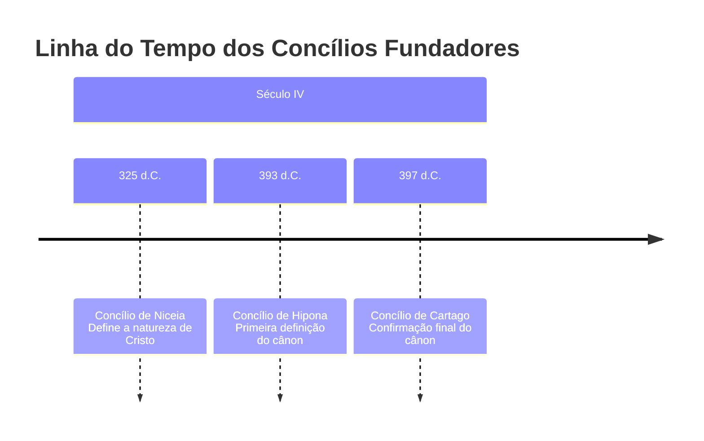

# 📜 Concílios Fundadores do Cristianismo

Vamos observar um análise comparativa dos três concílios mais importantes para a formação do Cânon bíblico e da doutrina cristã primitiva: **Niceia (325 d.C.)**, **Hipona (393 d.C.)** e **Cartago (397 d.C.)**.

## 🏛️ Comparação entre os Concílios

| Aspecto | Concílio de Niceia | Concílio de Hipona | Concílio de Cartago |
|---------|-------------------|-------------------|-------------------|
| **📅 Data** | 325 d.C. | 393 d.C. | 397 d.C. |
| **📍 Local** | Niceia (Turquia) | Hipona (Argélia) | Cartago (Tunísia) |
| **🌍 Escopo** | Ecumênico (Universal) | Regional (África) | Regional (África) |
| **🎯 Propósito** | Definir a natureza de Cristo | Organizar a Igreja e definir o Cânon | Ratificar e consolidar o Cânon |
| **👥 Liderança** | Imperador Constantino | Bispo Aurélio de Cartago | Bispo Aurélio de Cartago |
| **📜 Decisão Principal** | Credo Niceno (homoousios) | Primeira lista oficial do Cânon | Confirmação definitiva do Cânon |

## 🔍 Principais Decisões e Impactos

### 🏛️ **Concílio de Niceia (325 d.C.)**
- **✅ Definiu a doutrina da Santíssima Trindade**
- **✅ Estabeleceu o Credo Niceno**
- **✅ Condenou o Arianismo**
- **🎯 Impacto:** Fundamentou a doutrina cristã ortodoxa

### ⛪ **Concílio de Hipona (393 d.C.)**
- **✅ Primeira definição conciliar do Cânon bíblico**
- **✅ Estabeleceu os 27 livros do Novo Testamento**
- **✅ Incluiu os deuterocanônicos do AT**
- **🎯 Impacto:** Criou o primeiro padrão oficial das Escrituras

### ⛪ **Concílio de Cartago (397 d.C.)**
- **✅ Confirmação solene do Cânon de Hipona**
- **✅ Proibição formal de livros apócrifos no culto**
- **✅ Estabeleceu a lista definitiva de 27 livros do NT**
- **🎯 Impacto:** "Fechou" oficialmente o Cânon do NT no Ocidente

## 📚 Legado Conjunto

### **🎯 Definição Doutrinária**
- Niceia definiu **QUEM era Cristo** (divindade)
- Hipona e Cartago definiram **O QUE era a Escritura** (cânon)

### **🌍 Unificação da Fé**
- Criaram os alicerces para uma **Igreja universal** com doutrina e escrituras padronizadas
- Estabeleceram **mecanismos de autoridade** para decisões futuras

### **📖 Formação da Bíblia**
- O processo **começou com consenso informal** (séculos I-III)
- **Cristalizou-se com Atanásio** (367 d.C.)
- **Oficializou-se com Hipona** (393 d.C.)
- **Consolidou-se com Cartago** (397 d.C.)

## 💡 Significado Histórico

Estes três concílios representam a **transição crucial** do Cristianismo de:
- Uma fé perseguida para **religião imperial**
- Uma coleção de escritos para **um cânon fechado**
- Comunidades dispersas para **uma Igreja organizada**

## 🎯 Conclusão

Enquanto o **Concílio de Niceia** respondia à pergunta "*Quem é Jesus?*", os **Concílios de Hipona e Cartago** respondiam à pergunta "*O que é a Palavra de Deus?*". Juntos, eles forneceram os **dois pilares fundamentais** sobre os quais o Cristianismo se edificaria: **uma doutrina clara** e **um texto sagrado definido**.

> **Nota Importante:** A definição do Cânon foi um processo orgânico que levou séculos, culminando com a ratificação desses concílios regionais africanos pela autoridade de Roma, tornando-se assim o padrão para toda a Cristandade ocidental.